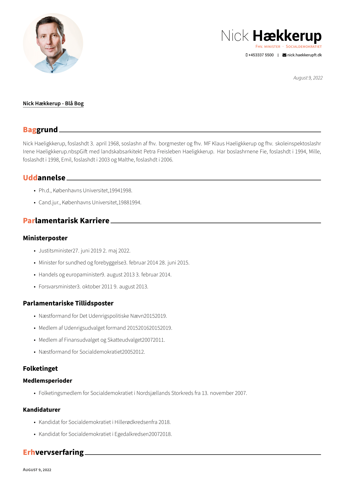
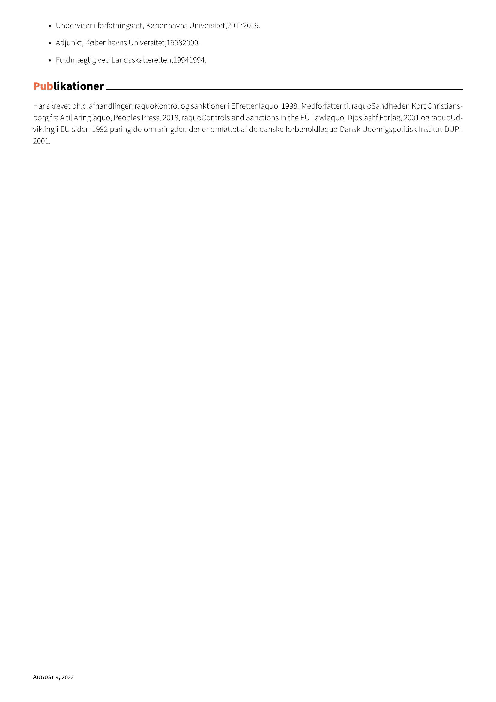

# dk_parliament
The dk_parliament python script allows you to quickly create visually appealing infosheets on sitting members of the Danish Parliament. It uses Python and XeLaTex to accomplish this. It is also a work in progress. 

## Current functionality 
Currently the main script, dk_parliament.py, can fetch the basic info and pictures from the Danish Parliament's Open Data database and output .tex files, which must then be compiled using XeLaTex for the intended output pdfs. The current layout is based on the [Awesome-CV class of posquit()](https://github.com/posquit0/Awesome-CV)

## Current work
Currently the main priority is adding the personal election results of each member of parliament to the basic info sheet output by the script.

## Example

## Future work 
There are several more things in the pipeline for this project. Amongst the most important can be mentioned: 

- Adding vote statistics from their time in Parliament
    - How often did a given MP vote for laws proposed by a left-wing administration? Right-wing administration?
    - How many questions did a given MP send to a given Minister? 
    - How often does a given MP participate in floor debates?
- Creating a new .tex-class for the output
    - Allow for a compiled pdf-file as opposed to individual files
    - Allow for compilation of selected MPs. 
- Add infosheets on the parties 
  
